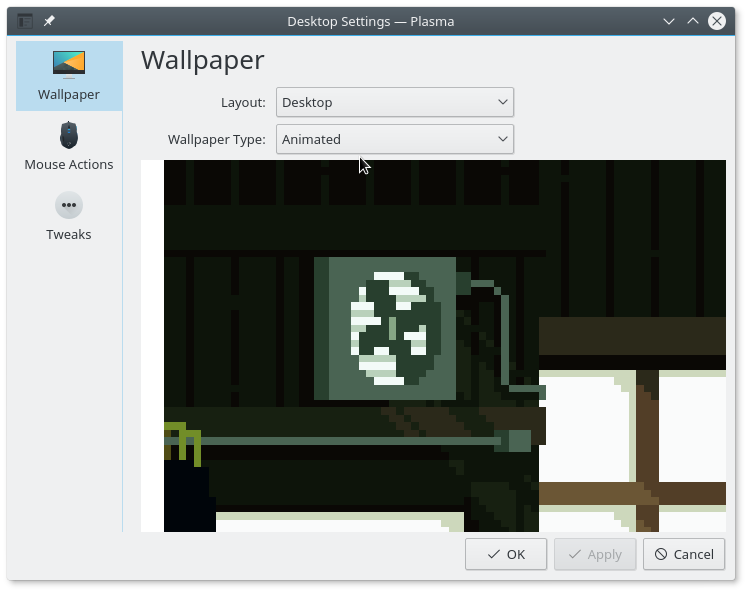

# Animated GIF wallpaper for KDE Plasma 5

[Demo Video](https://youtu.be/sGenByoaOpo)

- Put this in `~/.local/share/plasma/wallpapers/org.kde.animated`.
- Go to **Desktop Settings**, choose **Wallpaper Type: Animated GIF**, apply, profit.
- Optional: replace `contents/ui/animation.gif` with your animated gif of choice. You may need to
  tweak the image dimensions a bit in `contents/ui/main.qml`.

# TODO (read: probably never)

- Configurable wallpaper with proper file picker and stuff
- Support resolutions other than 1920x1080.

# Rice Rice Baby

If you're into this ricing stuff (which you probably shouldn't), here are the resources I used:

- [Video wallpaper tutorial](https://forum.kde.org/viewtopic.php?f=17&t=128820)
- [QML AnimatedImage documentation](http://doc.qt.io/qt-5/qml-qtquick-animatedimage.html)
- Plasma's own existing wallpaper types: probably in `/usr/share/plasma/wallpapers/`

A bird's eye view:

- **metadata.desktop**: self-explanatory
- **contents/ui/main.qml**: how to render the wallpaper
- **contents/ui/config.qml**: how to render the wallpaper config window
- You can preview your QML files quickly with `qmlscene <file>.qml`. Probably comes with QtCreator.
- May need to logout then login again for the updated `main.qml` to take effect. Or you can
  manually restart it with with `killall plasma && plasma`.

# Credits

The beaufiful GIF included here was made by [1041uuu](https://www.patreon.com/1041uuu). Check them
out!
